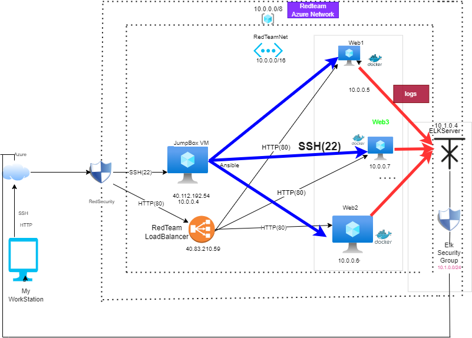

## Automated ELK Stack Deployment

The files in this repository were used to configure the network depicted below.

These files have been tested and used to generate a live ELK deployment on Azure. They can be used to either recreate the entire deployment pictured above. Alternatively, select portions of the Project 1 Red-Team Network Diagram file may be used to install only certain pieces of it, such as Filebeat.

  - _: This is the playbook file._
  Filebeat-playbook.yml
  Filebeat-configuration.yml

This document contains the following details:
- Description of the Topology
- Access Policies
- ELK Configuration
  - Beats in Use
  - Machines Being Monitored
- How to Use the Ansible Build

### Description of the Topology

The main purpose of this network is to expose a load-balanced and monitored instance of DVWA, the D*mn Vulnerable Web Application.

Load balancing ensures that the application will be highly  functional,in addition to restricting high-traffic to the network.
-  What aspect of security do load balancers protect? What is the advantage of a jump box?_

Load balancers distribute network traffic across a number of Servers and increase capacity and reliability of applications. It defends Distributed denial of Service attacks. 

 JumBox is a secured Virtual Machine which connects to the other Azure Virtual     Machine using Dynamic IP.  It helps to mitigate the risk of other VM  exposed to the public.

Integrating an ELK server allows users to easily monitor the vulnerable VMs for changes to the network and system logs.
- What does Filebeat watch for?
Filebeat forwards and centralizes logs data and it monitors the specified  log files or location and forwards them to ElasticSearch or Logstash for indexing. 

-  What does Metricbeat record?_
Metricbeat takes the metrics and statistics that it collects and ships them to the output that you specify through Elasticsearch or Logstash.It helps monitor the servers by collecting metrics from the system and services running on the server.

The configuration details of each machine may be found below.
_Note: Use the [Markdown Table Generator](http://www.tablesgenerator.com/markdown_tables) to add/remove values from the table_.

| Name      | Function    | IP Address       | Operating System |
|---------- |----------   |------------------|------------------|
| Jump Box  | Gateway     | 10.0.0.4(Private)| Linux            |
| ELK-SERVER|Load Balancer| 10.1.0.4(Private)| Linux            |
| Web1      |Load Balancer| 10.0.0.5(Private)| Linux            |         | Web2      |Load Balancer| 10.0.0.6(Private)| Linux            |

### Access Policies

The machines on the internal network are not exposed to the public Internet. 

Only the jump-Box-Provisioner machine can accept connections from the Internet. Access to this machine is only allowed from the following IP addresses:
- _ My whitelisted IP addresses is
192.168.6.1 

Machines within the network can only be accessed by Jump-Box-Provisioner .
-  Which machine did you allow to access your ELK VM?
  Jump-Box-Provisioner
  

 What was its IP address?
 40.112.192.54

A summary of the access policies in place can be found in the table below.

| Name     | Publicly Accessible | Allowed IP Addresses |
|----------|---------------------|----------------------|
| Jump Box | Yes                 |  192.168.6.1         |           
| ELK-VM   | No                  | 10.0.0.4             |
| Web1     | No                  | 10.0.0.5             |
| Web2     | No                  | 10.0.0.6             | 

All these VMs can only be accessed from the Jump-Box-Provisioner

### Elk Configuration

Ansible was used to automate configuration of the ELK machine. No configuration was performed manually, which is advantageous because...
- What is the main advantage of automating configuration with Ansible?_
The main advantage of automation Configuration with Ansible are as follows:
Application Deployment.
It can be customized.
Configuration Management.

The playbook implements the following tasks:
-  In 3-5 bullets, explain the steps of the ELK installation play. E.g., install Docker; download image; etc._
- SSH into JumpBox ( ssh RedAdmin@40.112.192.54)
- Start/Attached to the ansible docker (sudo docker start pensive_bell)/(sudo docker attach pensive_bell)
- /etc/ansible/files directory and created the ELK playbook (Elk_Playbook.yml)
- Run the Elk_Playbook.yml in that same directory (ansible-playbook Elk_Playbook.yml)
- SSH into the ELK-VM to verify the server is up and running.

 

The following screenshot displays the result of running `docker ps` after successfully configuring the ELK instance.

### Target Machines & Beats
This ELK server is configured to monitor the following machines:
- List the IP addresses of the machines you are monitoring
  Web1 (10.0.0.5)
  Web2 (10.0.0.6)

We have installed the following Beats on these machines:
- Specify which Beats you successfully installed
File Beats
Metrics Beat

These Beats allow us to collect the following information from each machine:
- _  The data file beat collects system logs, events, document reach accessed and the metrics beat contain the collects are as follows:
 Machine health 
 Performance
 System logs
 Events 

### Using the Playbook
In order to use the playbook, you will need to have an Ansible control node already configured. Assuming you have such a control node provisioned: 

SSH into the control node and follow the steps below:
- Copy the filebeat file to file-config.yml to /etc/ansible/role/files.
- Update the filebeat.yml file to include the ELK private IP
- Run the playbook, and navigate to http://20.185.243.66:5601/app/kibana#/home/ to check that the installation worked as expected.

_TAnswer the following questions to fill in the blanks:_
- _Which file is the playbook? 

Ansible-playbook files

Where do you copy it?_

/etc/ansible/files

- _Which file do you update to make Ansible run the playbook on a specific machine? 

/etc/ansible/hosts file (IP of the Virtual Machines).

How do I specify which machine to install the ELK server on versus which to install Filebeat on?_
Host name in Host Configuration file

- _Which URL do you navigate to in order to check that the ELK server is running?
http://20.185.243.66:5601

_As a **Bonus**, provide the specific commands the user will need to run to download the playbook, update the files, etc._
---
- name: Installing and Launch Filebeat
  hosts: webservers
  become: yes
  tasks:
    # Use command module
  - name: Download filebeat .deb file
    command: curl -L -O https://artifacts.elastic.co/downloads/beats/filebeat/filebeat-7.4.0-amd64.deb

    # Use command module
  - name: Install filebeat .deb
    command: dpkg -i filebeat-7.4.0-amd64.deb

    # Use copy module
  - name: Drop in filebeat.yml
    copy:
      src: /etc/ansible/files/filebeat-config.yml
      dest: /etc/filebeat/filebeat.yml

    # Use command module
  - name: Enable and Configure System Module
    command: filebeat modules enable system

    # Use command module
  - name: Setup filebeat
    command: filebeat setup

    # Use command module
  - name: Start filebeat service
    command: service filebeat start

    # Use systemd module
  - name: Enable service filebeat on boot
    systemd:
      name: filebeat
      enabled: yes

    # Use command module
  ---
- name: Install metric beat
  hosts: webservers
  become: true
  tasks:
    # Use command module
  - name: Download metricbeat
    command: curl -L -O https://artifacts.elastic.co/downloads/beats/metricbeat/metricbeat-7.4.0-amd64.deb

    # Use command module
  - name: install metricbeat
    command: dpkg -i metricbeat-7.4.0-amd64.deb

    # Use copy module
  - name: drop in metricbeat config
    copy:
      src: /etc/ansible/files/metricbeat-config.yml
      dest: /etc/metricbeat/metricbeat.yml

    # Use command module
  - name: enable and configure docker module for metric beat
    command: metricbeat modules enable docker

    # Use command module
  - name: setup metric beat
    command: metricbeat setup

    # Use command module
  - name: start metric beat
    command: service metricbeat start

    # Use systemd module
  - name: Enable service metricbeat on boot
    systemd:
      name: metricbeat
      enabled: yes

